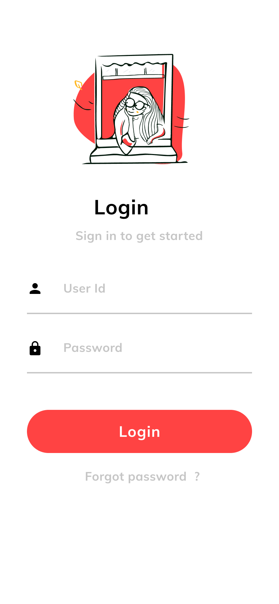
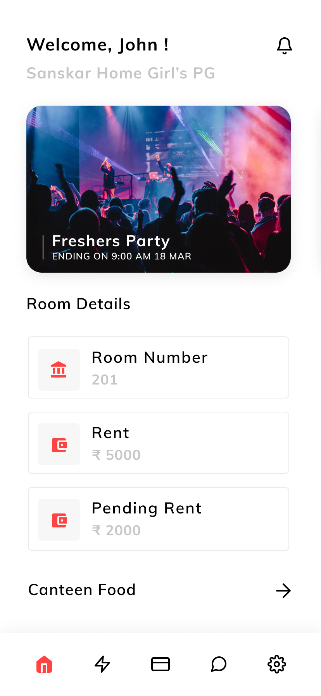
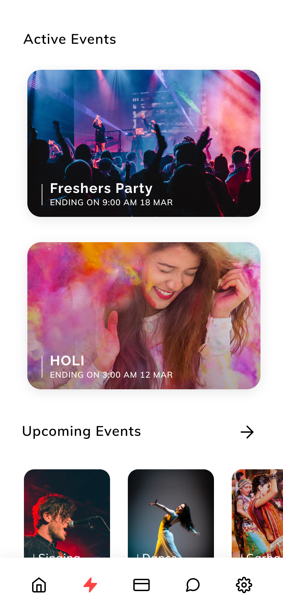
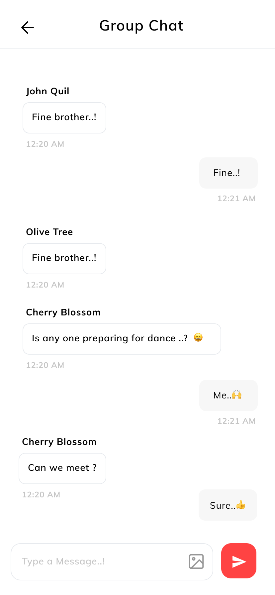
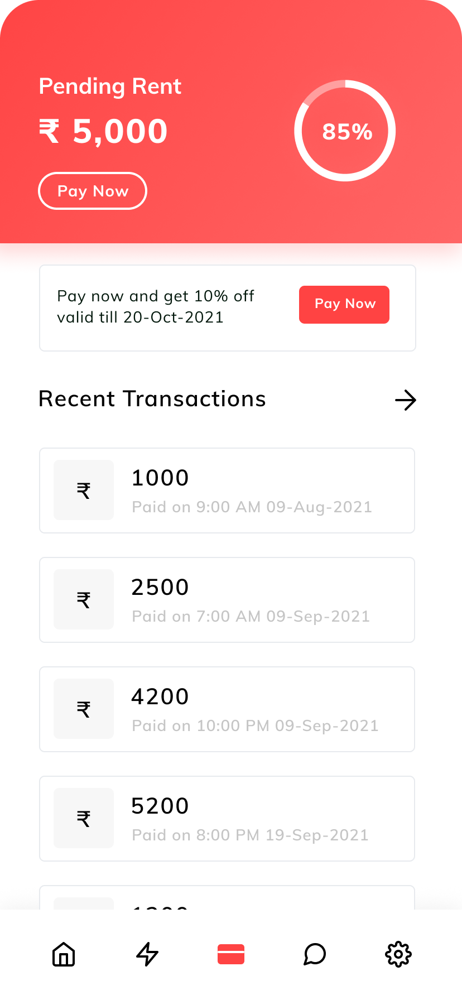

# Sanskar PG Admin App

<h3 style="font-size: 18px; letter-spacing: 1.2px">SCREEN SHOTS</h3>

<table>
  <tr>
    <td></td>
    <td></td>
    <td></td>
    <td></td>
    <td></td>
  </tr>
</table>

<h3 style="font-size: 18px; letter-spacing: 1.2px">ABOUT US</h3>

    
Introducing our PG management app! This all-in-one platform is designed to make life easier for both PG owners and residents. With features like room management, resident profiles, rent tracking, chat, and event planning, our app streamlines the entire PG management process.

<h3 style="font-size: 18px; letter-spacing: 1.2px">FEATURES</h3>

- Room Management: Allows PG owners to manage their available rooms, assign roommates, and keep track of vacancies.
- Resident Profiles: Enables PG owners to keep track of their residents' personal details, contact information, and lease agreements.
- Rent Tracking: Helps PG owners keep track of rent payments, late fees, and due dates.
- Chat: Facilitates communication between PG owners and their residents, allowing them to quickly resolve any issues or concerns.
- Event Planning: Allows PG owners to schedule and manage community events for their residents, such as game nights or barbecues.
- Maintenance Management (Suggested): Allows PG owners to manage and track maintenance requests from residents, and assign maintenance tasks to the appropriate staff members or contractors.

</ol>

<h3 style="font-size: 18px; letter-spacing: 1.2px">User App</h3>
https://github.com/Ajaysinh1290/sanskar-pg-admin-app
